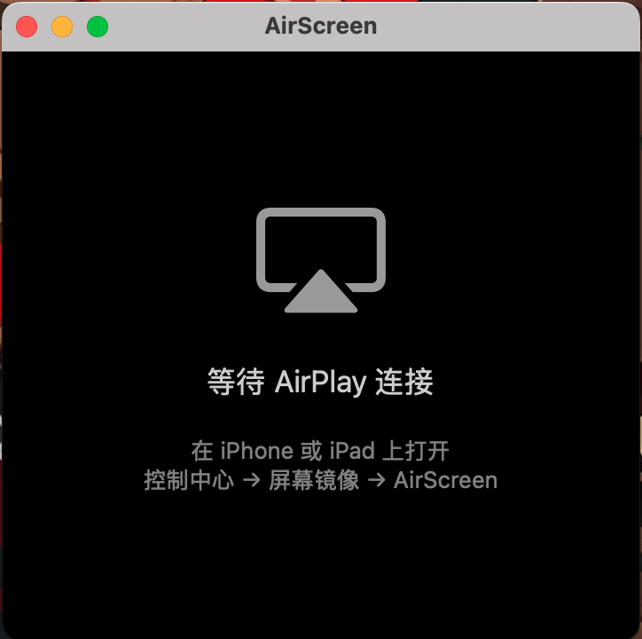
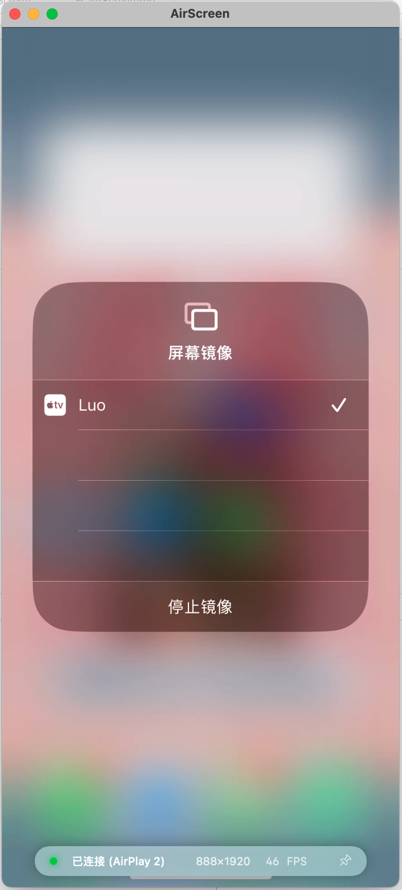

# AirScreen

## English

### Overview

AirScreen turns your Mac into a full AirPlay receiver. It handles discovery, RTSP control, RTP transport, FairPlay decryption, and Metal rendering so you can mirror iPhone, iPad, or macOS screens with low latency and synchronized audio/video playback.

### Key Features

- AirPlay screen mirroring and audio streaming with secure FairPlay SAP key exchange
- Low-latency H.264 decoding powered by VideoToolbox and depacketization logic
- Metal-based rendering pipeline that adapts to dynamic video resolutions
- Bonjour advertising plus RTSP/RTP session management for reliable streaming control
- AES-128-CTR decryption plus SAP key handling implemented via the embedded PlayFair C library

### Technical Stack

- Language: Swift + SwiftUI
- Rendering: Metal + MetalKit
- Video: VideoToolbox, H.264 depacketizer
- Audio: RTP receiver and synchronized playback layer
- Networking: Bonjour, RTSP, RTP, AES-128-CTR, FairPlay

### Screenshots

| Application state | Description |
| --- | --- |
|  | AirScreen ready to accept a connection |
|  | iPhone screen mirrored to the Mac |

> Need 中文? [Switch to README.zh.md](README.zh.md)
